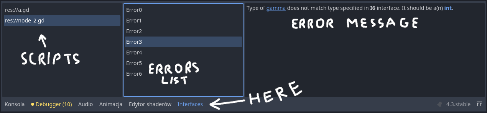

This addon implements interfaces for GDScript in GDScript it self.
# Functionalities
 - Global named interfaces
 - Unnamed interfaces
 - Implementing interfaces with functionalities check
 - Static typing interface
# Code examples
### Interface declaration
```gdscript
extends BasicInterface # needs to inherit from BasicInterface
class_name I # interface can be named

# Require implementing class to have these signals
signal sig_1
signal sig_2(number:int)

# Require implementing class to have these properties
var alfa          # alfa can be any type
var beta = 1.1    # beta also
var gamma: int    # gamma needs to be an int
var delta:= ""    # delta needs to be an String
var epsilon : A   # epsilon needs to be a user defined class named A

const NAME_OF_THE_GAME = "Very fun game" # Interfaces can define constants

enum AnEnum { # They can also define enumerations
	VALUE_1,
	VALUE_2,
	VALUE_22 = 22,
	SIZE,
}

# Require implementing class to have these methods
# foo must have no obligatory argument but it can have optional arguments
func foo() -> float: # foo must return a float
	return 0.0         # foo does not have to return this value, it can be any float

# bar must have one obligatory argument and one optional argument of any type but it can have more optional arguments
func bar(i:int,s=""): # bar can return something but it does not have to
	pass

func f3() -> void: # f3 also can return something but interface user will not be able to get it
	pass

# Interfaces can be defined as inner classes in script
class InnerInterface extends BasicInterface:
	# But they can't be inner class of an inner class
	class InnerInner extends BasicInterface:
		var a # this is useless
	@export var a: float # @export in interface definition does nothing
	var b: Vector4       # so it can be omitted
```
### Interface implementation
```gdscript
extends Label # class can extend any Object
class_name A  # class can be named

# A implements I interface and interface located in `object_with_id.gd` file
const IMPLEMENTS = ["I",preload("res://object_with_id.gd")]

# signals required by I
signal sig_1
signal sig_2(number:int)

# signals required by object_with_id.gd
signal id_changed

# other signals
signal text_changed

var alfa           # any type can stay any
var beta : Vector2 # or can be changed to some
var gamma : int = NAN   # properties can have default values
@export var delta := "" # and they can be exported
@onready var epsilon : A = $"." # this will also work

# Constants and Enumerations are defined inside interface script
# so they shouldn't be redefined in implementing class

# class can have more properties
var custom_name = "B"
var child_position := Vector2(100,10)

# class can have methods not specified in any implemented interface
func _ready() -> void:
	text = "A is ready"

func foo() -> float: # return type defined in I
	print("A's foo")   # foo can do anything
	return 69.13       # at the and it must return a float

# type of num can be any or int(I interface)
# type of s can't be specified(I interface)
# bar can have more optional arguments like m
func bar(num,s="",m:=""):
	if num is int:
		text += "  " + str(num) 
		print("The number: ", num)
	else:
		print(s,m)

func f3() -> int: # if A is used as I then user will not be able to use returned value
	return randi()

# method required by object_with_id.gd
func get_id(obj = self) -> int:
	return obj.get_instance_id()

func is_i4() -> bool:
	return "I4" in IMPLEMENTS # class can check what it implements
```
### Interface user
```gdscript
extends Node # it can be part of a scene

var test : I # Stores Object implementing I interface
var test_array : Array[I] = [] # Arrays are also compatible (from version 1.0.9)
var test_dict  : Dictionary[String,I] = {} # and so dictionaries

func use(i:I,_c:='A'):
	# references to constants in the interface need to prefixed with interface name
	print("This will be printed: ",I.NAME_OF_THE_GAME)
	print("This will throw error: ",i.NAME_OF_THE_GAME)
	i.foo()  # can use functions defined in I
	i.bar(randi())
	if i is A: # can use is that way but not opposite
		i.text += _c

func _ready() -> void:
	var a := A.new()
	add_child(a)
	test = Interfaces.as_interface(a) # use this function instead of `a as I`
	test = Interfaces.as_interface(a,"I") # expected interface can be specified
	test = Interfaces.as_interface(a,"I2") # throws error because a does not implement I2
	test = Interfaces.as_interface(a,"res://object_with_id.gd") # will work but does not make sense (object_with_id.gd does not extend I)
	use(test," an text") # will work because type of test is I
	var b = a
	use(b) # will work because type of b is not specified
	use(a) # will not work because type of a is A and A implements I not extends it.
	print(Interfaces.implements(a,"I2")) # prints false - A does not implement interface named I2
	print(Interfaces.implements(a,"res://object_with_id.gd")) # prints true - A implements interface defined in `object_with_id.gd`
```
# Interfaces tab bottom part of editor

Here all errors in defining, using or implementing interfaces will show up.
On the left are listed all opened scripts with errors.
If you select one of them then on the secound list all errors from that file will show up.
Selecting an error displays it message on the right.
Double click of an error will carry you to where it occurs.
# Interfaces class
Interfaces is a static class which contains methods used to work with interfaces
### implements(who:Object,what:StringName) -> bool
Returns `true` if `who` implements `what` interface.
`what` can be interface global name or path to it.
### as_interface(who:Object,interface:StringName=&"") -> Object
Returns `who` as an interface.
```
if interface != &"" then
```
Also checks if `who` implements `interface`.
To do that it uses `Interfaces.implements` function.
### extra_load_interface(p_script:Script) -> Error
Used to inform Interfaces class that interface defined in p_script exists.
Used internally.
# TODO
 - support _init functions with custom arguments
 - support binary format of scenes for built-in scripts
 - inspector support for export variables typed as interface
 - show line where error occured.
 - support for external editor (will need rework of core features)
 - automatic conversion from interfaces to traits (traits need to be completed first)
 - move implementation erros from bottom 'Interfaces' tab to Script Editor main window (might not be possible)
